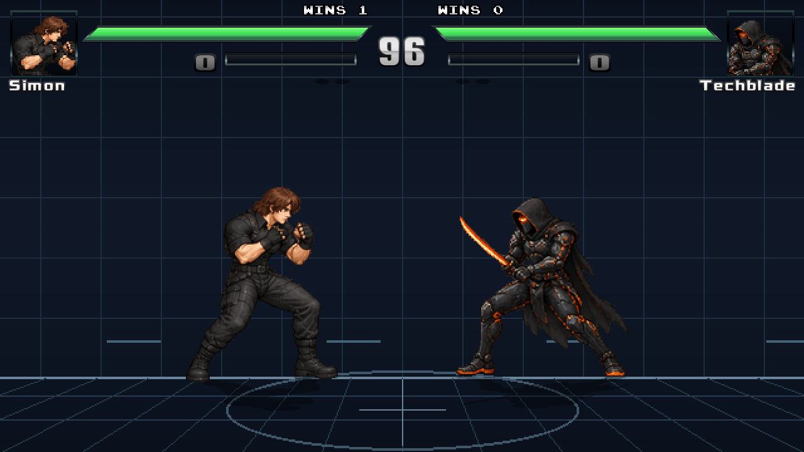

# CODE-ETER-COF — protótipo de combate 0.2

Jogo de luta 2D autoral, **1 contra 1**, com **Simon e Techblade jogáveis**, feito sobre **Ikemen GO 1.0.0**. O trabalho desta versão concentra-se no combate e nos personagens; o cenário é uma arena de treino.



## Jogar no Windows

1. Baixe o **ZIP Windows da versão 0.2** em [Releases](https://github.com/rafaelmateria889-ui/CODE-ETER-COF/releases) e extraia a pasta inteira. Alternativa: **Code → Download ZIP**, que baixa o código e instala o motor na primeira execução.
2. Abra **JOGAR.bat**.
3. O pacote Windows completo contém o motor. No ZIP do código, o iniciador baixa o Ikemen GO oficial e verifica seu SHA256 na primeira execução; essa instalação exige internet.
4. Escolha **VERSUS LOCAL**. P1 e P2 escolhem seus personagens e confirmam; P1 confirma a arena.

Não é necessário instalar Python, Java ou ferramentas de desenvolvimento no Windows. O jogo é nativo, não roda na página do GitHub.

O motor fica em `runtime/`. Configurações pessoais ficam em `runtime/save/eter.ini` e são preservadas nas próximas execuções. Se a instalação falhar, a mensagem permanece na janela.

**Linux:** execute `python3 tools/setup.py` (Python 3.10+). Necessita ambiente gráfico e OpenGL compatível. O executável Linux foi usado nos testes desta versão. O workflow verifica instalação e linha de comando no Windows; uma partida com GPU real nesse sistema continua pendente. Consulte o resultado do workflow associado ao commit.

## Teclado e controle

| Ação | P1 | P2 | Controle padrão Xbox |
|---|---|---|---|
| Movimentar / saltar / agachar | W A S D | Setas | Direcional |
| Soco leve (A) | F | I | X |
| Chute leve (B) | G | O | A |
| Soco forte (C) | H | K | Y |
| Chute forte (D) | J | L | B |
| Especial direto | E | P | RT |
| Teleporte / passo | Q | U | RB |
| Agarrão próximo | F + G | I + O | X + A |
| Confirmar | F ou Enter | I ou Shift direito | X / A / Start |
| Pausar | Esc | Esc | Back |

Recuar defende golpes altos; baixo + recuar defende baixos. Golpes aéreos exigem defesa alta. Agarrões não são bloqueáveis. Duplo toque para frente corre; duplo toque para trás recua rapidamente.

No menu **TECLADO / CONTROLE / OPCOES**, use a configuração de teclado ou joystick para remapear dispositivos. O primeiro controle é P1 e o segundo é P2 por padrão. Os rótulos acima seguem Xbox; outros modelos podem exigir remapeamento. **Controle físico não foi testado nesta sessão.**

## Golpes

As direções são relativas à posição do adversário. X/A/Y/B abaixo são os botões internos do motor (soco leve / chute leve / soco forte / chute forte).

| Comando | Simon | Techblade |
|---|---|---|
| ↓ ↘ → + soco leve | Fenda de Entrada | Investida Ígnea |
| ↓ ↙ ← + soco leve | Mão do Limiar | Corte de Pressão |
| → ↓ ↘ + soco leve | Ruptura Ascendente, provisória | Corte Ascendente |
| → ↓ ↘ + chute leve | Abraço do Abismo | Corte Ascendente |
| ↓ ↙ ← + chute leve/forte | Servo da Fenda | Passo Fantasma |
| ↓ ↘ → ↓ ↘ → + dois socos | Brecha Entre Mundos | Sobrecarga da Lâmina |

Soco forte substitui soco leve nas variantes fortes dos especiais; no agarrão especial, use chute forte. Variantes fortes ganham dano, alcance ou deslocamento com recuperação maior. O super exige e consome uma barra; somente ao acertar o primeiro golpe completa três impactos e um lançamento. Leves podem cancelar em fortes após contato; normais selecionados cancelam em especiais. Especiais têm recuperação, e agarrões falham fora de alcance. `docs/frame-data.json` contém os valores iniciais.

## Conteúdo desta versão

- Dois personagens selecionáveis, inclusive espelhados.
- Normais em pé, agachado e no ar; defesa, agarrão, corrida e recuo.
- Portais de Simon; katana, avanço e antiaéreo de Techblade.
- Hitboxes, hitstop, stun, pushback, vida, barra, KO e rounds no motor.
- Melhor de três rounds, 99 segundos, menu de pausa e modo de treino.
- Sprites originais gerados com GPT Image e preparados para animação nativa. Simon foi refinado usando os rostos de referência fornecidos pelo criador.
- Sons de golpes sintetizados pelo projeto; interface de luta e recursos comuns licenciados do Ikemen.

Simon agora invoca um servo que age uma vez e desaparece; há limite de uma invocação, cooldown e remoção por interrupção. O agarrão e o super usam tentáculos animados. Foram acrescentadas poses agachadas/aéreas. Alguns golpes ainda compartilham desenhos; a arte pode receber mais transições em futuras versões. O balanceamento é provisório. Consulte [DESIGN.md](DESIGN.md) e [a especificação original](docs/ESPECIFICACAO.md).

## Online

Rollback nativo habilitado, atraso inicial **2 frames**. A conexão usa **TCP 7500**, anfitrião **UDP 7600** e visitante **UDP 7550**. Siga [o guia de conexão e diagnóstico](docs/ONLINE.md).

Dois processos oficiais completaram dois rounds em loopback, sem aviso de dessíncronia e com resultados finais iguais. **Online entre redes distintas continua não verificado.** Não há matchmaking próprio nem garantia de ping. A Etapa D permanece aberta até testes em dois computadores/redes reais.

## Baixar e verificar

[Releases](https://github.com/rafaelmateria889-ui/CODE-ETER-COF/releases) contém o pacote Windows e o SHA256 quando o workflow de empacotamento conclui com sucesso. Compare no PowerShell: `Get-FileHash CODE-ETER-COF-v0.2.0-Windows.zip -Algorithm SHA256`.

O [ZIP do código](https://github.com/rafaelmateria889-ui/CODE-ETER-COF/archive/refs/heads/main.zip) permanece disponível; use JOGAR.bat para instalar/executar no Windows.

## Desenvolvimento

Os arquivos em `game/` são o conteúdo do jogo; o núcleo do Ikemen não foi alterado.

```bash
python3 -m pip install "Pillow>=11,<14"
python3 tools/build_characters.py
python3 tools/build_assets.py
python3 -m unittest discover -s tests -v
```

- `tools/build_characters.py`: dados de golpes e gerador de CNS/CMD.
- `tools/build_assets.py`: extração das folhas, animações, SFF, som e arena.
- `assets/source/`: folhas originais, incluindo Simon atualizado.
- `game/chars/`: arquivos editáveis que o motor consome.
- `game/data/eter/`: menus, seleção e configuração inicial.
- [Validação e limitações](docs/TESTES.md).
- [Origem e licenças](LICENSES.md).
